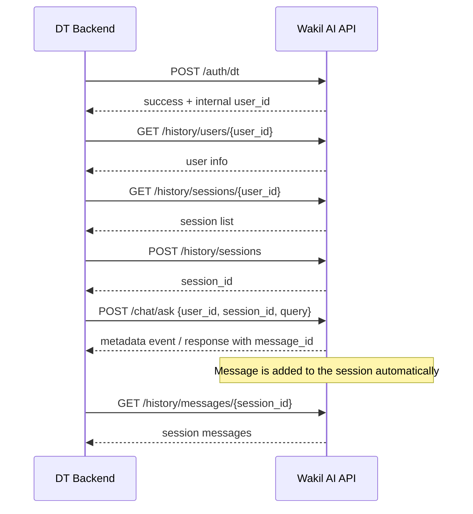

# DT Team Integration

This is the minimum integration flow for DT backend.

Base URL example:

```bash
export BASE_URL="http://localhost:8000/api/v2"
```

Headers used below:

```bash
export DT_KEY_HEADER="x-dt-team-api-key"
export DT_KEY_VALUE="<dt-team-api-key>"

export ADMIN_KEY_HEADER="admin"
export ADMIN_KEY_VALUE="admin"
```

Notes:

- `POST /auth/dt` requires the DT team key
- `/history/*` endpoints accept either the DT team key or the default admin key
- `POST /chat/ask` currently requires the default admin key
- `session_id` is required for chat requests
- `message_id` is created by the server automatically

## 1. Create DT User

Create the user once from DT backend.

```bash
curl -X POST "$BASE_URL/auth/dt" \
  -H "Content-Type: application/json" \
  -H "$DT_KEY_HEADER: $DT_KEY_VALUE" \
  -d '{
    "user_id": "dt-user-1001",
    "phone_number": "+998901234567",
    "first_name": "Ali",
    "last_name": "Valiyev",
    "username": "ali.valiyev"
  }'
```

Example response:

```json
{
  "success": true,
  "user_id": "user-019d3abc-1234-7abc-9def-1234567890ab"
}
```

Save the returned `user_id`. This is the internal Wakil AI user ID and should be used in the next steps.

## 2. Check User

Fetch the user by internal `user_id`.

```bash
curl "$BASE_URL/history/users/user-019d3abc-1234-7abc-9def-1234567890ab" \
  -H "$DT_KEY_HEADER: $DT_KEY_VALUE"
```

Example response:

```json
{
  "info": {
    "_id": "user-019d3abc-1234-7abc-9def-1234567890ab",
    "username": "ali.valiyev",
    "first_name": "Ali",
    "last_name": "Valiyev",
    "phone_number": "+998901234567",
    "is_blocked": false,
    "created_at": "2026-03-28T10:00:00.000000",
    "updated_at": "2026-03-28T10:00:00.000000"
  },
  "message": "User retrieved"
}
```

## 3. List Sessions

List all sessions for the user.

```bash
curl "$BASE_URL/history/sessions/user-019d3abc-1234-7abc-9def-1234567890ab" \
  -H "$DT_KEY_HEADER: $DT_KEY_VALUE"
```

Example response:

```json
[
  {
    "user_id": "user-019d3abc-1234-7abc-9def-1234567890ab",
    "_id": "ses-019d3def-5678-7abc-9def-1234567890ab",
    "title": "New Chat",
    "tags": [],
    "created_at": "2026-03-28T10:10:00.000000",
    "updated_at": "2026-03-28T10:10:00.000000"
  }
]
```

## 4. Create Session

Create a session when the user clicks `New Chat`.

```bash
curl -X POST "$BASE_URL/history/sessions" \
  -H "Content-Type: application/json" \
  -H "$DT_KEY_HEADER: $DT_KEY_VALUE" \
  -d '{
    "user_id": "user-019d3abc-1234-7abc-9def-1234567890ab",
    "title": "New Chat",
    "tags": []
  }'
```

Example response:

```json
{
  "user_id": "user-019d3abc-1234-7abc-9def-1234567890ab",
  "_id": "ses-019d3fff-9999-7abc-9def-1234567890ab",
  "title": "New Chat",
  "tags": [],
  "created_at": "2026-03-28T10:15:00.000000",
  "updated_at": "2026-03-28T10:15:00.000000"
}
```

Save the returned session ID from `_id`.

## 5. Ask Chat

Send the question with `session_id`.

The message is added to the session automatically by the server, so DT does not need to call `POST /history/messages`.

### Streaming example

```bash
curl -N -X POST "$BASE_URL/chat/ask" \
  -H "Content-Type: application/json" \
  -H "Accept: text/event-stream" \
  -H "$ADMIN_KEY_HEADER: $ADMIN_KEY_VALUE" \
  -d '{
    "user_id": "user-019d3abc-1234-7abc-9def-1234567890ab",
    "session_id": "ses-019d3fff-9999-7abc-9def-1234567890ab",
    "query": "How to make marriage?",
    "stream": true,
    "assistant": "main"
  }'
```

Example streaming output:

```text
data: {"type":"metadata","session_id":"ses-019d3fff-9999-7abc-9def-1234567890ab","message_id":"msg-019d4000-aaaa-7abc-9def-1234567890ab"}

data: {"type":"chunk","chunk":"To register a marriage in Uzbekistan, ..."}

data: {"type":"chunk","chunk":"you usually need both parties' IDs, ..."}

data: {"type":"end"}
```

Important:

- read `message_id` from the first `metadata` event
- use that `message_id` for feedback, sharing, or client-side mapping
- no separate message-create call is needed

### Non-stream example

```bash
curl -X POST "$BASE_URL/chat/ask" \
  -H "Content-Type: application/json" \
  -H "$ADMIN_KEY_HEADER: $ADMIN_KEY_VALUE" \
  -d '{
    "user_id": "user-019d3abc-1234-7abc-9def-1234567890ab",
    "session_id": "ses-019d3fff-9999-7abc-9def-1234567890ab",
    "query": "How to make marriage?",
    "stream": false,
    "assistant": "main"
  }'
```

Example response:

```json
{
  "answer": "To register a marriage in Uzbekistan, ...",
  "session_id": "ses-019d3fff-9999-7abc-9def-1234567890ab",
  "message_id": "msg-019d4000-aaaa-7abc-9def-1234567890ab",
  "latency_ms": 1842,
  "attachments": null
}
```

## 6. List Messages For Session

After asking, list messages for that session.

```bash
curl "$BASE_URL/history/messages/ses-019d3fff-9999-7abc-9def-1234567890ab" \
  -H "$DT_KEY_HEADER: $DT_KEY_VALUE"
```

Example response:

```json
[
  {
    "session_id": "ses-019d3fff-9999-7abc-9def-1234567890ab",
    "_id": "msg-019d4000-aaaa-7abc-9def-1234567890ab",
    "user_id": "user-019d3abc-1234-7abc-9def-1234567890ab",
    "content": {
      "query": "How to make marriage?",
      "response": "To register a marriage in Uzbekistan, ..."
    },
    "metadata": {
      "assistant": "main",
      "stream": true,
      "latency_ms": 1842,
      "model": "gpt-4.1",
      "token_usage": {
        "input_token": 23,
        "context_token": 1480,
        "output_token": 210,
        "embedding_input_token": 29
      }
    },
    "created_at": "2026-03-28T10:20:00.000000",
    "updated_at": "2026-03-28T10:20:02.000000"
  }
]
```

## Quick Flow Summary

1. `POST /auth/dt` -> create user once
2. `GET /history/users/{user_id}` -> check user
3. `GET /history/sessions/{user_id}` -> list chats
4. `POST /history/sessions` -> create session for `New Chat`
5. `POST /chat/ask` -> ask using `session_id`, server returns `message_id`
6. `GET /history/messages/{session_id}` -> fetch session messages

## Diagram


