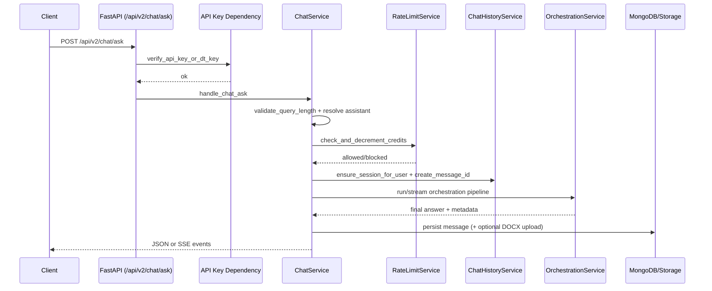

# API v2 Chat Ask — End-to-End Request Flow

This document explains what happens step-by-step when a user sends:

- `POST /api/v2/chat/ask`

`/api/v2/chat/ask` and `/api/v3/chat/ask` use the same implementation (`app.api.v3.chat` + `ChatService.handle_chat_ask`), so this flow applies to both.

---

## 1) Client sends request

Example:

```http
POST /api/v2/chat/ask
admin: <api-key>
Content-Type: application/json

{
  "user_id": "user-123",
  "session_id": "sess-456",
  "query": "Ish beruvchining mehnat shartnomasini bekor qilish tartibi qanday?",
  "assistant": "main",
  "stream": false
}
```

Main request fields:
- `user_id` — the user making the request.
- `session_id` — existing chat session owned by that user.
- `query` — user question.
- `assistant` — optional; defaults to `main`.
- `stream` — optional; if omitted, server uses global `STREAM` setting.
- `file_ids`, `project_id`, `file_context` — optional context enrichments.

---

## 2) Authentication and route resolution

1. FastAPI dependency `verify_api_key_or_dt_key` runs first.
2. Request is accepted only if either:
   - the regular API key header (`admin` by default) is valid, or
   - the DT team API key header is valid.
3. Router mapping:
   - `/api/v2/chat/ask` is backward-compatible and re-exports the v3 router.
   - Actual handler: `app.api.v3.chat.ask_question`.
4. Handler delegates to `ChatService.handle_chat_ask`.

If auth fails, request stops here with `401/403`.

---

## 3) Input validation and assistant resolution

Inside `handle_chat_ask`:

1. Query length is validated against `MAX_QUERY_LENGTH`.
2. Assistant is validated (or defaulted) via `AssistantConfig`.
3. Assistant config is loaded:
   - `credit_cost`
   - collection/routing metadata used later by orchestration.

If query is too long, request fails with `QueryTooLongException`.

---

## 4) Credit check and deduction

Before orchestration starts, credits are checked and decremented:

1. `RateLimitService.check_and_decrement_credits` is called.
2. Credit behavior:
   - **Paid pool subscription** (`standard/pro/test`): spends from monthly `credits_remaining`.
   - **Free/daily-pass/promo users**: spends from daily quota.
   - **Unlimited promo**: request is allowed with unlimited marker.
3. If credits are insufficient, request returns an insufficient credits error.

Important: credit deduction happens before answer generation.

---

## 5) Session validation, project linking, message allocation

`prepare_chat_request` performs pre-generation state setup:

1. Confirms session exists.
2. Confirms session belongs to `user_id`.
3. Resolves effective `project_id`:
   - uses request `project_id` if provided, otherwise session project.
4. If needed, links session to project (with ownership checks).
5. Allocates a new `message_id` (uuid7-based short ID).

If session ownership or project constraints fail, request returns validation errors.

---

## 6) Branch decision: streaming vs non-streaming

`stream` is resolved as:
- request `stream` if provided
- otherwise global `settings.STREAM`

Then flow splits:

- `stream=true` → SSE response (`text/event-stream`) via `astream_orchestrated_chat`.
- `stream=false` → regular JSON response via `run_orchestrated_chat`.

---

## 7) Orchestration pipeline (query processing core)

Both branches use the orchestration service (`app/orchestration`) and pass payload with:
- query, user/session/message IDs
- assistant
- optional file/project context

High-level orchestration steps:

1. Load file/project context (if provided).
2. Rewrite query using conversation context.
3. Recognize legal intent (assistant-dependent).
4. Route court-specific requests when needed.
5. Retrieve legal context (Milvus, or criminal graph path when applicable).
6. Optionally evaluate context and use web-search fallback (deep-research scenarios).
7. Generate final answer with the configured chat model.

For a deeper node-level description, see [How LangGraph orchestration works](explanation-orchestration.md).

---

## 8) Post-generation processing

After final answer is produced:

1. DT-team disclaimer is appended for DT-key requests.
2. Attachments are merged (if orchestration produced any).
3. For `contract_analyzer` (except risk-analysis intent), a DOCX file of final answer may be generated and uploaded; attachment URL is added.
4. `latency_ms` is computed.
5. Response/message metadata is built (assistant used, model info, workflow flags, token usage if present, attachments, etc.).

---

## 9) Persistence

Message is stored in MongoDB `messages` with:
- `session_id`, `message_id`, `user_id`
- `content.query`, `content.response`
- metadata (assistant/latency/stream/model/workflow/etc.)
- optional file IDs and project linkage

Persistence behavior differs by mode:
- **Non-streaming:** persistence is scheduled asynchronously in background.
- **Streaming:** persistence is awaited before final `end` SSE event.

---

## 10) Response back to client

### Non-streaming (`stream=false`)

Client receives JSON:

```json
{
  "answer": "...",
  "session_id": "sess-456",
  "message_id": "msg-...",
  "latency_ms": 1234,
  "attachments": []
}
```

### Streaming (`stream=true`)

Client receives SSE events in order:
1. `metadata` event with `session_id` and `message_id`
2. optional early `attachments` event(s)
3. streamed answer chunks
4. optional final merged `attachments` event
5. `end` event with latency and identifiers

---

## 11) Common failure points (where request can stop)

- Authentication failure (`401/403`)
- Query too long
- Invalid/unknown assistant
- User/session mismatch or missing session
- Project access/link validation failure
- Insufficient credits
- Orchestration/provider/database errors

Unhandled internal errors are wrapped to chat-generation errors with server logging.

---

## Quick sequence diagram


