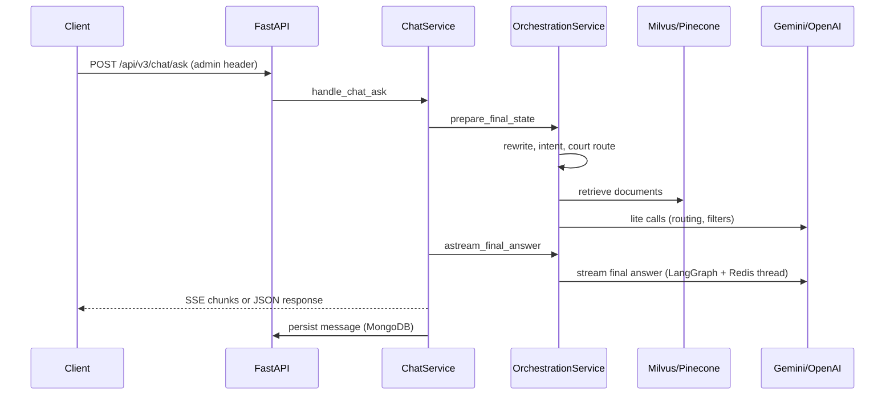

# WakilAI REST API — Developer Onboarding

Welcome. This guide gets you from zero to a running local instance and explains how the codebase is organized. Use it as your first read; deeper references are linked at the end.

---

## What this repository is

**WakilAI REST API** is a FastAPI backend for Uzbek legal AI:

- **Chat** — retrieval-augmented answers across specialized assistants (general law, tax, courts, contracts, criminal cases).
- **History** — users, sessions, messages, files, feedback, legal **projects**.
- **Auth** — Google OAuth, Telegram login, DT/OneID integration.
- **Credits & billing** — rate limits, promo codes, Payme/Click payments.
- **Speech-to-text** — REST and WebSocket transcription.
- **Admin** — Telegram chats, super-admin operations.

The main product flow is: client sends a question → orchestration retrieves legal context → Gemini (or configured models) streams an answer → result is persisted in MongoDB.

---

## Prerequisites

| Tool | Version / notes |
|------|-----------------|
| **Python** | 3.10+ (Docker image uses 3.10; local 3.11 is fine) |
| **Git** | — |
| **Docker** | Optional but recommended for Redis |
| **MongoDB** | Required for users, chat history, billing |
| **Milvus** or **Pinecone** | Required for vector search (Milvus is the default) |
| **Redis Stack** | Required for LangGraph checkpoints (RedisJSON + RediSearch) |

### API keys you will need (ask your team)

| Key | Used for |
|-----|----------|
| `GEMINI_API_KEY` | Final answers and most generation (required for orchestration) |
| `OPENAI_API_KEY` | Lite tasks when `DEFAULT_LITE_MODEL` is an OpenAI model (rewrite, routing, filters) |
| Embedding provider | `SILICONFLOW_API_KEY`, `NOVITA_API_KEY`, or local Qwen endpoint — see `EMBEDDING_MODEL` |
| `API_KEY` | Protecting API routes in dev |
| `MONGODB_URI` | Primary database |
| `MILVUS_URI` | Vector search (if `VECTOR_DB_TYPE=milvus`) |
| Optional | `TAVILY_API_KEY` (web search), `GCS_*` (file uploads), Langfuse, Payme, Azure/Google STT |

---

## Quick start (local development)

### 1. Clone and configure environment

```bash
git clone <repository-url>
cd rest-api
cp .env.example .env
```

Edit `.env` with at least:

```env
DEBUG=true
API_KEY=dev-local-key-change-me

MONGODB_URI=mongodb://localhost:27017
MONGODB_DB_NAME=wakilai

VECTOR_DB_TYPE=milvus
MILVUS_URI=http://localhost:19530
MILVUS_MAIN_NAME=lexuz

REDIS_HOST=localhost
REDIS_PORT=6379

GEMINI_API_KEY=<your-key>
OPENAI_API_KEY=<your-key>
DEFAULT_LITE_MODEL=gpt-4.1-mini

EMBEDDING_MODEL=siliconflow
SILICONFLOW_API_KEY=<your-key>
```

> **Note:** `.env.example` is not exhaustive. Orchestration also reads `GEMINI_API_KEY`, `REDIS_*`, and Neo4j settings from `src/core/config.py`. If something fails at startup, check that file for the full list of settings.

### 2. Python virtual environment

```bash
python3 -m venv .venv
source .venv/bin/activate
pip install -r requirements.txt
```

### 3. Start dependencies

**Redis Stack** (LangGraph checkpoints — plain Redis is not enough):

```bash
docker run -d --name wakilai-redis -p 6379:6379 redis/redis-stack-server:7.4.0-v3
```

**MongoDB** and **Milvus** — see [deployment.md](deployment.md) for Docker commands, or use shared dev instances from your team.

### 4. Run the API

```bash
uvicorn app.main:app --host 0.0.0.0 --port 8080 --reload
```

Health check (no auth):

```bash
curl http://localhost:8080/health
```

### 5. Call chat (authenticated)

First create a user and session (required before the first chat):

```bash
# Create user
curl -X POST http://localhost:8080/api/v2/history/users \
  -H "admin: dev-local-key-change-me" \
  -H "Content-Type: application/json" \
  -d '{"id": "dev-user-1", "first_name": "Dev", "auth_method": "api"}'

# Create session — note the returned _id (e.g. "sess_abc")
curl -X POST http://localhost:8080/api/v2/history/sessions \
  -H "admin: dev-local-key-change-me" \
  -H "Content-Type: application/json" \
  -d '{"user_id": "dev-user-1", "title": "dev session"}'
```

Then send a chat request (replace `sess_abc` with your session `_id`):

```bash
curl -X POST http://localhost:8080/api/v3/chat/ask \
  -H "admin: dev-local-key-change-me" \
  -H "Content-Type: application/json" \
  -d '{
    "user_id": "dev-user-1",
    "session_id": "sess_abc",
    "query": "Nikoh qonuni qanday?",
    "assistant": "main",
    "stream": false
  }'
```

See [tutorial-first-chat.md](tutorial-first-chat.md) for a full walkthrough.

**Swagger UI** (HTTP Basic — `DOCS_USER` / `DOCS_PASSWORD` from `.env`):

- http://localhost:8080/docs

---

## Docker development (API + Redis)

Production-like stack from the repo root:

```bash
docker compose -f compose.yml -f dev/compose.override.dev.yml up --build
```

- API on port **8080** with hot reload (`./app` mounted).
- Redis from `compose.yml`.
- MongoDB and Milvus are still external unless you add them to compose.

---

## Repository layout

```
rest-api/
├── src/
│   ├── main.py              # FastAPI app, lifespan, routers
│   ├── api/v2/              # History, auth, admin, payments, STT, …
│   ├── api/v3/chat.py       # Primary chat endpoints (v2 re-exports same router)
│   ├── core/                # config, dependencies, logging, Langfuse
│   ├── orchestration/       # LangGraph pipeline, prompts, retrieval routing
│   ├── assistants/          # Per-assistant retrieval + generation helpers
│   ├── retrieval/           # Milvus/Pinecone, embeddings
│   ├── services/            # Chat, history, files, payments, rate limits, …
│   ├── models/              # Pydantic request/response models
│   ├── db/                  # Mongo, Milvus handlers
│   └── security/            # API key auth, GCS creds path
├── docs/                    # Feature and architecture docs
├── compose.yml              # API replicas + Redis Stack
├── dev/compose.override.dev.yml
├── requirements.txt
├── Dockerfile
└── .env.example
```

### Where to change what

| Task | Start here |
|------|------------|
| New HTTP route | `src/api/v2/` or `src/api/v3/` |
| Chat / streaming behavior | `src/services/chat_service.py` |
| Orchestration pipeline (rewrite → retrieve → answer) | `src/orchestration/` (`graph.py`, `nodes.py`, `service.py`) |
| Assistant prompts | `src/orchestration/prompts/` |
| Milvus collection / filter logic | `src/assistants/`, `src/orchestration/agents/milvus_agent.py` |
| Credits / rate limits | `src/services/rate_limit_service.py` |
| Env / feature flags | `src/core/config.py` |

---

## Request flow (chat)

High-level path for `POST /api/v3/chat/ask`:



**Orchestration stages** (`src/orchestration/service.py` → `_prepare_final_state_inner`):

1. Load file / project context  
2. Ingest payload, merge LangGraph thread history from Redis  
3. Query rewrite, intent recognition, court routing  
4. Criminal-case subgraph (if `criminal_court` assistant)  
5. Document retrieval (assistant-specific Milvus / Neo4j)  
6. Optional Tavily web search when context is insufficient  
7. Stream final answer with `ChatGoogleGenerativeAI` (`src/orchestration/llms.py`)

**Streaming events** (SSE): `metadata` → optional `attachments` → text chunks → optional `think` → final `attachments` / `end`. See `src/utils/streaming.py`.

---

## Assistants

Assistants are configured in `src/core/config.py` (`ASSISTANTS` dict) and exposed via `GET /api/v3/chat/assistants`.

| Canonical name | Role |
|----------------|------|
| `main` | General legal RAG (LexUZ / main Milvus collection) |
| `tax` | Tax law |
| `court` | Routes to administrative / economic / supreme court assistants |
| `contract_analyzer` | Contract risk + template generation |
| `criminal_court` | Criminal law (Neo4j + Mongo subgraph + v2 prompts) |

**Aliases** (API accepts old names): `deepresearch` → `main`, `soliq` → `tax`, `court` / `sud` → `court`, etc. See `src/core/assistants.py`.

Each assistant has a **credit cost**; requests are rejected when the user has insufficient credits (`InsufficientCreditsException`).

---

## Authentication headers

| Header | Config | Who uses it |
|--------|--------|-------------|
| `admin` | `API_KEY_NAME` (default: `admin`) | WakilAI web app, internal tools |
| `x-dt-team-api-key` | `DT_API_KEY_NAME` | DT / birdarcha backend |
| `x-super-admin-key` | `SUPER_ADMIN_KEY_NAME` | Sensitive admin only |

Most routes under `/api/v2` and `/api/v3` require `admin` **or** `x-dt-team-api-key`. See [updates-v2.md](updates-v2.md) for recent route moves (promo codes, rate limits).

---

## Data stores

| Store | Purpose |
|-------|---------|
| **MongoDB** | Users, sessions, messages, files, credits, promos, payments |
| **Milvus** | Legal document embeddings (per-assistant collections) |
| **Redis Stack** | LangGraph `AsyncRedisSaver` — per-session agent thread state |
| **Neo4j** | Criminal case graph (optional; `NEO4J_URI`) |
| **GCS** | Uploaded file blobs |
| **Mem0** | Long-term memory (optional) |

Collection names and schemas: [database-architecture.md](database-architecture.md).

---

## Environment variables cheat sheet

### Minimum to run a chat locally

- `API_KEY`, `MONGODB_URI`, `MILVUS_URI`, `GEMINI_API_KEY`, `OPENAI_API_KEY` (if lite model is OpenAI), embedding keys for `EMBEDDING_MODEL`, `REDIS_HOST` / `REDIS_PORT`

### Orchestration / LLM

| Variable | Default / role |
|----------|----------------|
| `GEMINI_API_KEY` | Required for final answer generation |
| `DEFAULT_CHAT_MODEL` | e.g. `gemini-3.1-pro-preview` |
| `DEFAULT_LITE_MODEL` | Routing, rewrite, Milvus filter (`gpt-4.1-mini`) |
| `GEMINI_LANGCHAIN_THINKING_LEVEL` | `minimal` \| `low` \| `medium` \| `high` |
| `OUTPUT_MAX_TOKENS` | Max generation length |
| `TEMPERATURE` | Generation temperature |

### Infrastructure

| Variable | Role |
|----------|------|
| `VECTOR_DB_TYPE` | `milvus` or `pinecone` |
| `LANGGRAPH_CHECKPOINT_USE_REDIS` | Must be `true` for agent memory |
| `LANGFUSE_TRACING_ENABLED` | Optional LLM tracing |

Full defaults live in `src/core/config.py` and `.env.example`.

---

## Common development tasks

### Enable debug payloads in responses

```env
DEVELOPMENT_MODE=true
```

See [development-mode.md](development-mode.md) for response shape (retrieved docs + processing logs).

### Enable Langfuse tracing

```env
LANGFUSE_TRACING_ENABLED=true
LANGFUSE_PUBLIC_KEY=...
LANGFUSE_SECRET_KEY=...
LANGFUSE_BASE_URL=https://cloud.langfuse.com
```

### Compile-check after orchestration changes

```bash
.venv/bin/python -m compileall src/orchestration src/services src/assistants src/main.py
```

### List public assistants

```bash
curl http://localhost:8080/api/v3/chat/assistants -H "admin: $API_KEY"
```

---

## Debugging tips

| Symptom | Likely cause |
|---------|----------------|
| `GEMINI_API_KEY is required` | Missing key in `.env` |
| `NotImplementedError` on checkpoint | Redis is plain Redis, not **Redis Stack** |
| `TransferEncodingError` / connection reset during chat | Upstream Gemini stream dropped (network/API); retry; check Langfuse/logs |
| Empty retrieval | Milvus down, wrong `MILVUS_URI`, or empty collection |
| 401 on API | Wrong header name (`admin` vs `x-api-key` in old docs) or `API_KEY` mismatch |
| Credits errors | User has no credits in `creditusage` collection |

Logs use **Loguru** (`src/core/logger.py`). Orchestration errors are logged from `src/services/chat_service.py` with full tracebacks when `exc_info=True`.

---

## API versions

| Prefix | Status |
|--------|--------|
| `/api/v3/chat/*` | **Preferred** for new integrations |
| `/api/v2/chat/*` | Same router as v3 (backward compatible) |
| `/api/v2/history/*` | Sessions, messages, files, projects |
| `/api/v2/auth/*` | OAuth / Telegram |

Full endpoint list: [api-reference.md](api-reference.md).  
v3 release notes: [updates-v3.md](updates-v3.md).

---

## Documentation map

### Tutorials
| Topic | Document |
|-------|----------|
| First API call end-to-end | [tutorial-first-chat.md](tutorial-first-chat.md) |
| SSE streaming + deep research | [tutorial-streaming.md](tutorial-streaming.md) |
| File upload + project chat | [tutorial-file-upload.md](tutorial-file-upload.md) |

### How-to guides
| Topic | Document |
|-------|----------|
| Production deployment | [howto-deploy-production.md](howto-deploy-production.md) |
| Switch LLM provider | [howto-switch-llm-provider.md](howto-switch-llm-provider.md) |
| Payment processing | [howto-configure-payments.md](howto-configure-payments.md) |
| Persistent memory | [howto-enable-memory.md](howto-enable-memory.md) |
| Speech-to-text | [howto-speech-to-text.md](howto-speech-to-text.md) |
| Monitoring & tracing | [howto-monitor-usage.md](howto-monitor-usage.md) |

### Reference
| Topic | Document |
|-------|----------|
| All environment variables | [reference-environment-variables.md](reference-environment-variables.md) |
| LangGraph state & nodes | [reference-langgraph-state.md](reference-langgraph-state.md) |
| Milvus filter syntax | [reference-milvus-filters.md](reference-milvus-filters.md) |
| Error codes | [reference-error-codes.md](reference-error-codes.md) |
| All endpoints | [api-reference.md](api-reference.md) |
| MongoDB collections | [database-architecture.md](database-architecture.md) |

### Explanations
| Topic | Document |
|-------|----------|
| LangGraph orchestration pipeline | [explanation-orchestration.md](explanation-orchestration.md) |
| Hybrid vector search | [explanation-hybrid-search.md](explanation-hybrid-search.md) |
| Assistant routing strategy | [explanation-assistant-routing.md](explanation-assistant-routing.md) |
| Credit system | [explanation-credit-system.md](explanation-credit-system.md) |

### Other
| Topic | Document |
|-------|----------|
| Milvus / Mongo deploy | [deployment.md](deployment.md) |
| Docker topology | [infrastructure.md](infrastructure.md) |
| Frontend route migration | [updates-v2.md](updates-v2.md) |
| Credits & rate limits | [rate-limiting.md](rate-limiting.md) |
| Promo codes | [promo-codes.md](promo-codes.md) |
| File uploads & projects | [file-management.md](file-management.md) |
| DT integration | [dt-team-integration.md](dt-team-integration.md) |

Root overview: [README.md](../README.md). Full index: [README.md](README.md).

---

## Suggested first-week checklist

- [ ] Run API locally and get `GET /health` → 200  
- [ ] Send one non-streaming and one streaming `POST /api/v3/chat/ask`  
- [ ] Open `/docs` and skim chat + history routes  
- [ ] Read `src/orchestration/graph.py` and trace one request in logs  
- [ ] Confirm Redis Stack and MongoDB connectivity with your team’s dev URIs  
- [ ] Skim [database-architecture.md](database-architecture.md) for `users` / `sessions` / `messages`  
- [ ] Get access to shared Milvus/GCS/Langfuse from your lead  

---

## Getting help

- **Config source of truth:** `src/core/config.py`  
- **Breaking API changes:** `CHANGELOG.md`, `docs/updates-v2.md`, `docs/updates-v3.md`  
- **Infrastructure / deploy:** platform team + [deployment.md](deployment.md)  

If onboarding doc is outdated, update this file in the same PR as the code change.
